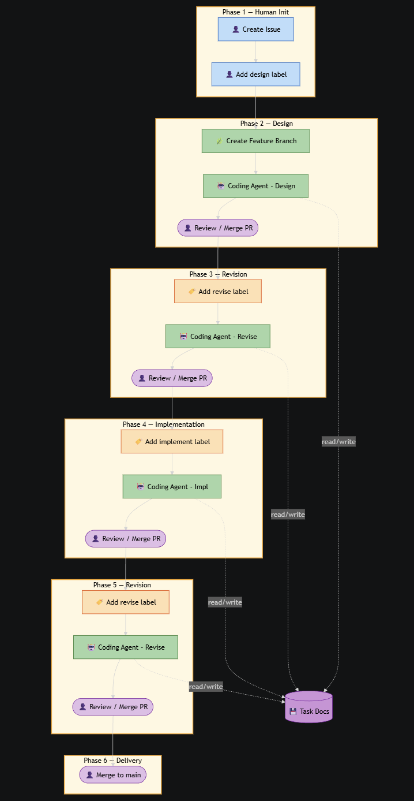

# GitHub Coding Agent Workflow

An automated AI coding agent workflow powered by GitHub Copilot and GitHub Actions. Issues go through a four-stage workflow — design, design revision, implementation, and implementation revision — each orchestrated by label-triggered workflows and automatically advanced by a stage-router.

## Key Benefits
- Fully automated four-stage workflow: design, design revision, implementation, and implementation revision
- Follows spec-driven development pattern — Copilot produces a design document based on the issue description before writing any code
- Every design and implementation goes through a second-pass review and revision by Copilot
- Each stage has customizable agent to ensure Copilot behaves as expected
- Each stage can use a different model, balancing cost and quality
- Leverages GitHub Copilot's native cloud coding agent to execute each stage
- Human in the loop — every stage output is reviewed and approved before proceeding
- Each issue is developed on an isolated feature branch, keeping the main branch stable
- Open architecture — stages can be added, removed, or reconfigured as needed, and even work with other CLI-based agents
- Easily kick off or approve the workflow from GitHub mobile

## How It Works

### Stage Pipeline

When an issue is labeled, the corresponding workflow fires, assigns the issue to Copilot, and the AI agent works on it. After Copilot opens a PR and it gets merged, the **stage-router** automatically labels the issue with the next stage.

| Stage | Label | Model | Description |
|---|---|---|---|
| Design | `ai-design` | gpt-5.4 | Analyze issue requirements, produce `docs/tasks/<issue-number>/task.md` |
| Design Revise | `ai-design-revise` | claude-opus-4.6 | Review and revise `task.md` |
| Implement | `ai-implement` | claude-opus-4.6 | Implement code per `task.md`, save summary to `implement.md` |
| Implement Revise | `ai-implement-revise` | gpt-5.4 | Review implementation, make targeted revisions |

### Required GitHub Action Secret

| Secret | Usage |
|---|---|
| `COPILOT_ACTION_TOKEN` | Copilot agent assignment (requires Copilot access) |

## How to Start
1. there are sample docs in the `docs/` folder which is about a trip planner app. You can refer to the samples to create your own `requirements.md`, `design.md` and `tasks.md` for your repo.
2. create issues based on the content in tasks.md one by one
3. modify AGENTS.md to update the coding guideline if needed
4. add ai-design label to the issue to kick off the workflow, then review and merge the PR for each stage
5. after the four stages are complete, merge the feature branch to main.
