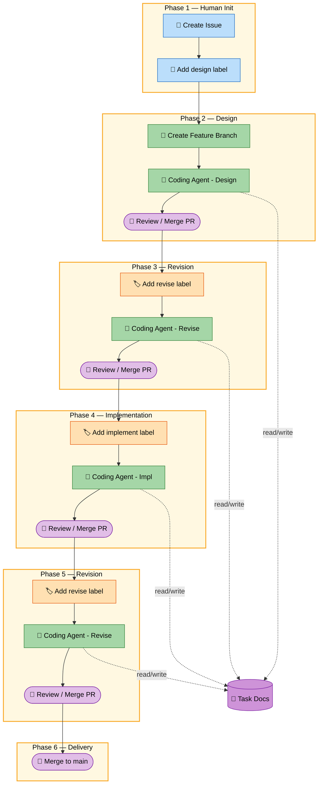

```mermaid
flowchart TD
    %% ===== Phase 1 - Init =====
    subgraph P1["Phase 1 — Human Init"]
        direction TB
        A1["👤 Create Issue"]
        A2["👤 Add design label"]
    end

    A1 --> A2

    %% ===== Phase 2 - Design =====
    subgraph P2["Phase 2 — Design"]
        direction TB
        B1["🌿 Create Feature Branch"]
        B2["🤖 Coding Agent - Design"]
        B4(["👤 Review / Merge PR"])
    end

    A2 --> B1
    B1 --> B2 --> B4

    %% ===== Phase 3 - Design Revise =====
    subgraph P3["Phase 3 — Revision"]
        direction TB
        C0["🏷️ Add revise label"]
        C1["🤖 Coding Agent - Revise"]
        C4(["👤 Review / Merge PR"])
    end

    B4 --> C0
    C0 --> C1 --> C4

    %% ===== Phase 4 - Implement =====
    subgraph P4["Phase 4 — Implementation"]
        direction TB
        D0["🏷️ Add implement label"]
        D1["🤖 Coding Agent - Impl"]
        D4(["👤 Review / Merge PR"])
    end

    C4 --> D0
    D0 --> D1 --> D4

    %% ===== Phase 5 - Implement Revise =====
    subgraph P5["Phase 5 — Revision"]
        direction TB
        E0["🏷️ Add revise label"]
        E1["🤖 Coding Agent - Revise"]
        E4(["👤 Review / Merge PR"])
    end

    D4 --> E0
    E0 --> E1 --> E4

    %% ===== Phase 6 - Done =====
    subgraph P6["Phase 6 — Delivery"]
        direction TB
        F1(["👤 Merge to main"])
    end

    E4 --> F1

    %% ===== Persistent Storage =====
    DB[("💾 Task Docs")]

    B2 -. "read/write" .-> DB
    C1 -. "read/write" .-> DB
    D1 -. "read/write" .-> DB
    E1 -. "read/write" .-> DB

    %% ===== Styles =====
    style P1 fill:#fff8e1,stroke:#f9a825,stroke-width:2px,color:#000
    style P2 fill:#fff8e1,stroke:#f9a825,stroke-width:2px,color:#000
    style P3 fill:#fff8e1,stroke:#f9a825,stroke-width:2px,color:#000
    style P4 fill:#fff8e1,stroke:#f9a825,stroke-width:2px,color:#000
    style P5 fill:#fff8e1,stroke:#f9a825,stroke-width:2px,color:#000
    style P6 fill:#fff8e1,stroke:#f9a825,stroke-width:2px,color:#000

    style A1 fill:#bbdefb,stroke:#1565c0,color:#000
    style A2 fill:#bbdefb,stroke:#1565c0,color:#000

    style B1 fill:#a5d6a7,stroke:#2e7d32,color:#000
    style B2 fill:#a5d6a7,stroke:#2e7d32,color:#000
    style B4 fill:#e1bee7,stroke:#7b1fa2,color:#000

    style C0 fill:#ffe0b2,stroke:#e65100,color:#000
    style C1 fill:#a5d6a7,stroke:#2e7d32,color:#000
    style C4 fill:#e1bee7,stroke:#7b1fa2,color:#000

    style D0 fill:#ffe0b2,stroke:#e65100,color:#000
    style D1 fill:#a5d6a7,stroke:#2e7d32,color:#000
    style D4 fill:#e1bee7,stroke:#7b1fa2,color:#000

    style E0 fill:#ffe0b2,stroke:#e65100,color:#000
    style E1 fill:#a5d6a7,stroke:#2e7d32,color:#000
    style E4 fill:#e1bee7,stroke:#7b1fa2,color:#000

    style F1 fill:#e1bee7,stroke:#7b1fa2,color:#000

    style DB fill:#ce93d8,stroke:#7b1fa2,color:#000
```
